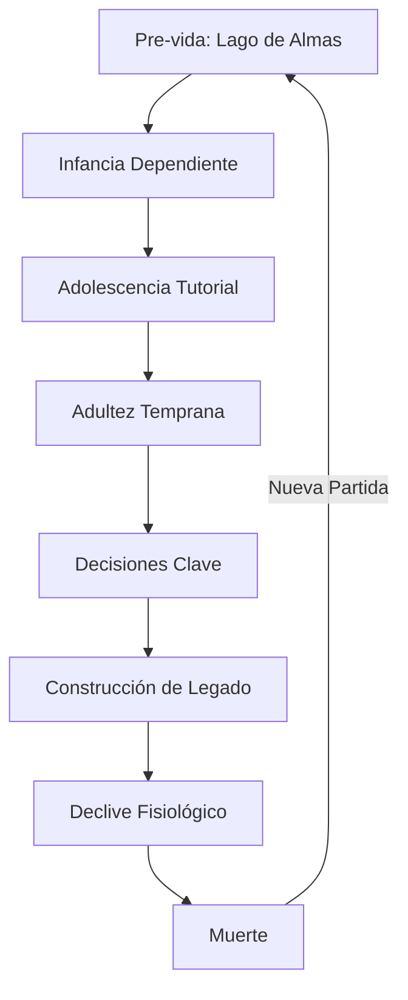

# 🎮 Game Bible - [El Alto de las Viudas]

*Última actualización: [2025-08-19]*

---

## 📖 Índice
1. [Visión General](#-visión-general)
2. [Mundo del Juego](#-mundo-del-juego)
3. [Personajes](#-personajes)
4. [Historia Principal](#-historia-principal)
5. [Mecánicas de Juego](#-mecánicas-de-juego)
6. [Estilo Visual](#-estilo-visual)
7. [Audio y Música](#-audio-y-música)
8. [Referencias](#-referencias)

---

## 🌟 Visión General
**Título completo**: El Alto de las Viudas.  
**Género**:  RPG Existencial.
**Plataformas**: PC Cenital. 
**Público objetivo**: 21+ (Adultos que buscan reflexión sobre ciclos vitales).
**Duración estimada**: 75 días.
**Tono y Estilo**: Crudo, realista y filosófico.
**Elevator Pitch**: "Un RPG que simula el ciclo completo de la vida humana, donde cada decisión altera irreversiblemente tu destino y legado."

---

## 🗺️ Mundo del Juego
### 🌍 Concepto Central
- **Tema**: La crudeza cíclica de la existencia humana  
- **Mecánica única**: Tiempo real irreversible (75 días = 1 vida completa)  
- **Filosofía**: Determinismo vs libre albedrío  

### 📜 Reglas del Universo
- **Magia/tecnología**: 
- **Tabúes sociales**:  
- **Economía/recursos**:  DINERO (Tiempo de servicio)

---

## 🧑‍🤝‍🧑 Personajes
### 👤 Protagonista(s)
| Nombre | Edad | Rol | Motivación | Arco de desarrollo |
|--------|------|-----|------------|--------------------|
|        |      |     |            |                    |

### 🦹 Antagonista(s)
| Nombre | Tipo de villano | Objetivos | Debilidades |
|--------|-----------------|-----------|-------------|
|        |                 |           |             |

### 🎭 NPCs Importantes
- **Nombre NPC 1**: Breve descripción + relación con el jugador  
- **Nombre NPC 2**: Breve descripción + rol en la historia  

---

## 📜 Historia Principal
### 🎞️ Estructura Narrativa

## 🏷️ Key Moments

Momento 0: El jugador antes de nacer se encuentra en la NADA, pero en realidad es un lago en donde todo es blanco y hay muchas almas que cuentan sus historias. (Intro + Tutorial.)
Momento 1: Un jugador después de purgar sus pecados nacerá... pero solo estará en desarrollo todo dependen de la crianza de sus padres. (Tutorial.)
Momento 2: El jugador nacerá pero no podrá valerse por si mismo todo dependerá de sus cuidadores. (Tutorial interración y desarrollo.)
Momento 3: El jugador empezará a valerse por si mismo pero dependerá economicamente de sus padre. (Tutorial necesidades e interración.)
Momento 4: El jugador podrá valerse por si mismo pero deberá desarrollar habilidades para sobrevivir de adulto. (GAMEPLAY.)
Momento 5: El jugador tendrá que escoger un camino de vida. (GAMEPLAY.)
Momento 6: El jugador tomo demasiadas desisiones que lo impactaron a el mismo y a los demás por ello su historia se adapta. (GAMEPLAY.)
Momento 7: El jugador puede tomar la decición de hacer parte de una familia. (GAMEPLAY.)
Momento 8: El jugador se enfrenta al envejecimiento y el fin de su vida. (GAMEPLAY.)
Momento 9: El ciclo se repite.

## 🎮 Mecánicas de Juego

## 👁️ Visión (0 - 1)

vision < 0.30 → “Modo eco-oscuro”
 
La pantalla se vuelve negra (sin escena base) ,El mundo solo se “revela” con ondas provocadas por eventos sonoros.Ondas visibles: anillos que se expanden desde la fuente y pintan temporalmente el contorno de paredes/suelos/entidades.

En este modo el juego cambia:
* El sonido puede venir desde las pisadas, palamdas, fuentes de sonido... y las ondas son visibles.

0.30 ≤ vision < 0.50 → “Visión borrosa”
 
El juego se vuelbe borroso y los objetos lejanos son solo manchas. Se soluciona con tener unos anteojos.

vision ≥ 0.50 → “Visión normal”
 
Renderizado estandar.

## 👂 Oido (0 - 1)

hearing = 0.0 → Sordera
 
Lo unico que se escucha son los latidos internos, y pulsos breves al caminar o tocar objetos... pero solo si está cerca del juagdor.

0.30 ≤ hearing < 0.5 → Hipoacusia severa / casi sordo
 
Sonidos muy apagados o inexistentes, se corrige con audifino.

hearing ≥ 0.50 → Audición plena
 
Sonido normal.

## ✋ Tacto (0 - 1)

touch < 0.30 → “Torpeza motora severa”
 
El jugador pierde precisión en los controles:

Movimientos con retardo o desviaciones aleatorias.

Difícil interactuar con objetos pequeños (ej: acertar una palanca).

0.30 ≤ touch < 0.50 → “Falta de sensibilidad”
 
El jugador siente menos retroalimentación:

Las animaciones de golpe no muestran recoil claro.

Posibilidad de recibir daño por fuego, pinchos o paredes con retraso en la percepción.

touch ≥ 0.50 → “Tacto normal”
 
Movimiento y manipulación precisos.

## 👅 Gusto (0 - 1)

taste < 0.30 → “Sin gusto”
 
El jugador no detecta venenos o comidas dañadas, puede consumir objetos peligrosos sin advertencia.

0.30 ≤ taste < 0.50 → “Gusto debilitado”
 
El jugador distingue sabores básicos pero confunde comidas en mal estado. Puede comer alimentos que reduzcan estadísticas sin saberlo.

taste ≥ 0.50 → “Gusto normal”
 
Puede detectar comidas podridas o envenenadas antes de consumirlas.

## 👃 Olfato (0 - 1)

smell < 0.30 → “Sin olfato”
 
No percibe olores de peligro ni ventajas:

No detecta trampas químicas o humo tóxico.

No encuentra comida escondida.

0.30 ≤ smell < 0.50 → “Olfato débil”
 
Percibe olores fuertes, pero pierde los más sutiles. Puede detectar fuego cercano pero no comida podrida.

smell ≥ 0.50 → “Olfato normal”
 
Detecta peligros, rastros de enemigos y calidad de los alimentos.

Nota: los sentidos se van disminuyendo respectivamente al envejecimiento del jugador.

## ⚙️ Sistemas Clave

Combate: (Estilo, profundidad, recursos)
Progresión: (Niveles, habilidades, árboles de skill)
Economía: (Monedas, crafting, tiendas)

## 💰 Moneda: Labros Chronos Servitia (LCS)

El valor no se mide únicamente en metales preciosos o bienes materiales, sino en la más escasa de todas las riquezas: el tiempo de servicio prestado.

Labros → El trabajo y esfuerzo manual o intelectual invertido.
Chronos → El tiempo vital que cada individuo dedica.
Servitia → Los servicios y obligaciones cumplidos en favor de otros.

Cada LCS representa una unidad estandarizada de tiempo de servicio registrado en los archivos del Gremio Central, garantizando que su valor no fluctúe por caprichos de nobles o mercaderes, sino por la constancia y dedicación de los ciudadanos.

En las antiguas ciudades estado, el pago en LCS era tanto un reconocimiento de mérito como una promesa de intercambio justo. Incluso hoy, las transacciones con LCS llevan implícito un sentido de honor: quien recibe estas monedas acepta el legado de horas, sudor y compromiso que representan.

El emblema oficial de la moneda muestra un reloj de arena custodiado por dos manos entrelazadas, símbolo de que el tiempo y el servicio son indivisibles. Su lema, grabado en cada pieza, reza: "Tempus Laborem Servitium" — “Tiempo Trabajo de Servicio”.

## 🎨 Estilo Visual

🖌️ Fotografias.

## 🖼️ Arte Conceptual

(Enlace a carpeta de concept art o imágenes incrustadas)

## 🎵 Audio y Música

🎶 Tono Musical
Géneros principales:
Temas recurrentes:
Compositores de referencia:

📚 Referencias

- TAMAGOCHI.
- GAMEBOY ADVANCE.
- Super Nintendo.
- Metal Gear (NES).
- Mario Bros (NES).
- Zelda 2 (NES).
- Dark Echo (PC).
- 