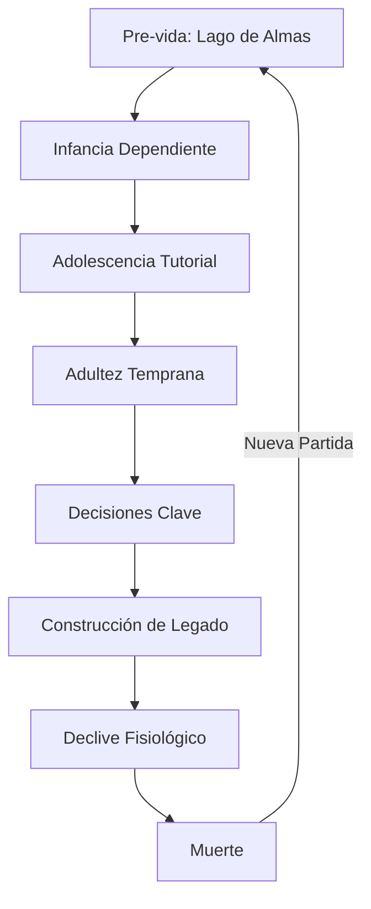

# 🎮 Game Bible - [El Alto de las Viudas]

*Última actualización: [2025-07-25]*

---

## 📖 Índice
1. [Visión General](#-visión-general)
2. [Mundo del Juego](#-mundo-del-juego)
3. [Personajes](#-personajes)
4. [Historia Principal](#-historia-principal)
5. [Mecánicas de Juego](#-mecánicas-de-juego)
6. [Estilo Visual](#-estilo-visual)
7. [Audio y Música](#-audio-y-música)
8. [Referencias](#-referencias)

---

## 🌟 Visión General
**Título completo**: El Alto de las Viudas.  
**Género**:  RPG Existencial.
**Plataformas**: PC Cenital. 
**Público objetivo**: 21+ (Adultos que buscan reflexión sobre ciclos vitales).
**Duración estimada**: 75 días.
**Tono y Estilo**: Crudo, realista y filosófico.
**Elevator Pitch**: "Un RPG que simula el ciclo completo de la vida humana, donde cada decisión altera irreversiblemente tu destino y legado."

---

## 🗺️ Mundo del Juego
### 🌍 Concepto Central
- **Tema**: La crudeza cíclica de la existencia humana  
- **Mecánica única**: Tiempo real irreversible (75 días = 1 vida completa)  
- **Filosofía**: Determinismo vs libre albedrío  

### 📜 Reglas del Universo
- **Magia/tecnología**: 
- **Tabúes sociales**:  
- **Economía/recursos**:  DINERO (Tiempo de servicio)

---

## 🧑‍🤝‍🧑 Personajes
### 👤 Protagonista(s)
| Nombre | Edad | Rol | Motivación | Arco de desarrollo |
|--------|------|-----|------------|--------------------|
|        |      |     |            |                    |

### 🦹 Antagonista(s)
| Nombre | Tipo de villano | Objetivos | Debilidades |
|--------|-----------------|-----------|-------------|
|        |                 |           |             |

### 🎭 NPCs Importantes
- **Nombre NPC 1**: Breve descripción + relación con el jugador  
- **Nombre NPC 2**: Breve descripción + rol en la historia  

---

## 📜 Historia Principal
### 🎞️ Estructura Narrativa

## 🏷️ Key Moments

Momento 0: El jugador antes de nacer se encuentra en la NADA, pero en realidad es un lago en donde todo es blanco y hay muchas almas que cuentan sus historias. (Intro + Tutorial.)
Momento 1: Un jugador después de purgar sus pecados nacerá... pero solo estará en desarrollo todo dependen de la crianza de sus padres. (Tutorial.)
Momento 2: El jugador nacerá pero no podrá valerse por si mismo todo dependerá de sus cuidadores. (Tutorial interración y desarrollo.)
Momento 3: El jugador empezará a valerse por si mismo pero dependerá economicamente de sus padre. (Tutorial necesidades e interración.)
Momento 4: El jugador podrá valerse por si mismo pero deberá desarrollar habilidades para sobrevivir de adulto. (GAMEPLAY.)
Momento 5: El jugador tendrá que escoger un camino de vida. (GAMEPLAY.)
Momento 6: El jugador tomo demasiadas desisiones que lo impactaron a el mismo y a los demás por ello su historia se adapta. (GAMEPLAY.)
Momento 7: El jugador puede tomar la decición de hacer parte de una familia. (GAMEPLAY.)
Momento 8: El jugador se enfrenta al envejecimiento y el fin de su vida. (GAMEPLAY.)
Momento 9: El ciclo se repite.

## 🎮 Mecánicas de Juego

🕹️ Core Gameplay Loop
Acción principal → 2. Recompensa → 3. Mejora → 4. Nueva acción

## ⚙️ Sistemas Clave

Combate: (Estilo, profundidad, recursos)
Progresión: (Niveles, habilidades, árboles de skill)
Economía: (Monedas, crafting, tiendas)

## 🎨 Estilo Visual

🖌️ Fotografias.

## 🖼️ Arte Conceptual

(Enlace a carpeta de concept art o imágenes incrustadas)

## 🎵 Audio y Música

🎶 Tono Musical
Géneros principales:
Temas recurrentes:
Compositores de referencia:

📚 Referencias

- TAMAGOCHI.
- GAMEBOY ADVANCE.
- 