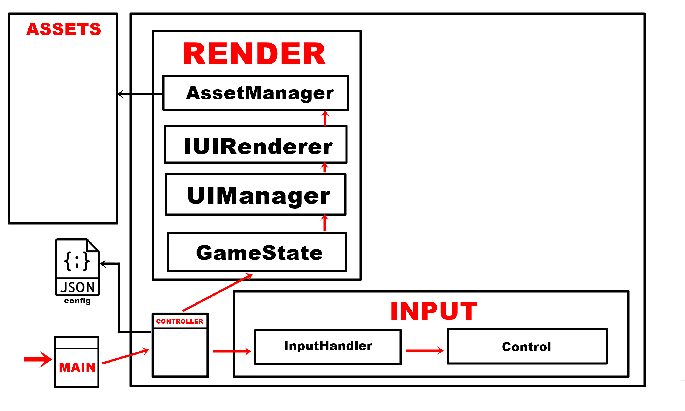

<h1 align="center"> FelipedelosH </h1>
<br>
<h4>El Alto De Las Viudas</h4>


:construction: IN CONSTRUCTION :construction:
<br><br>
"El Alto De Las Viudas" is a game developed in Python with a modular architecture based on interfaces and decoupled rendering, allowing for easy extension and maintenance. The project incorporates clean design principles and a clear folder structure.

## :hammer:General Architecture:



## :hammer:Funtions:

- `Function 1`: Neque porro quisquam est qui dolorem ipsum quia dolor sit amet.<br>
- `Function 2`: Neque porro quisquam est qui dolorem ipsum quia dolor sit amet.<br>
- `Function 3`: Neque porro quisquam est qui dolorem ipsum quia dolor sit amet.<br>
- `Function 3a`: Neque porro quisquam est qui dolorem ipsum quia dolor sit amet.<br>
- `Function 4`: Neque porro quisquam est qui dolorem ipsum quia dolor sit amet.<br>

## :hammer:FuntionsArchitecture:

```
my_game_project/
├── assets/          
│   ├── images/
│   ├── sounds/
│   ├── music/
│   └── fonts/
│
├── config/ 
│
├── Docs/
│
├── logs/
│
├── src/
│   ├── commands/                   
│   ├── core/
│   ├── ecs/              
│   ├── entities/          
│   ├── levels/            
│   ├── UI/                
│   |── systems/           
│
│
├── UTILS/
│   ├── MapGenerator/
│
├── data/                 
│
├── tests/                 
│                
├── .gitignore 
├── main.py 
├── readme.md             
└── requirements.txt      
```

## :play_or_pause_button:How to execute a project

```
python main.py
```

## :hammer_and_wrench:Tech.

- Python
- Tkinter

## :warning:Warning.

- limitations.

## Autor

| [<br><sub>Andrés Felipe Hernánez</sub>](https://github.com/felipedelosh)|
| :---: |